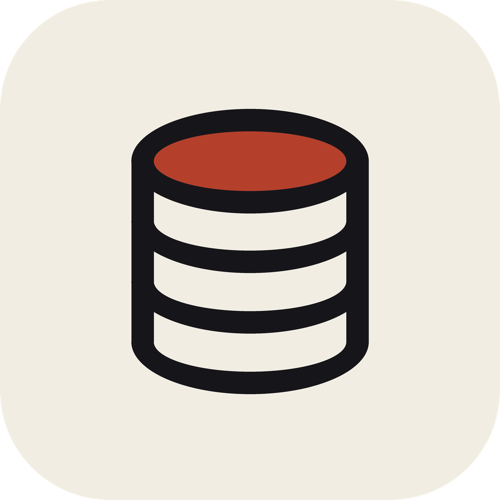

# MagicSoftSQL

<p align="center">
  
</p>

[](https://github.com/your-org/flutter_sql_converter)
[](https://flutter.dev)
[](https://dart.dev)
[](#)
[](#)

A high-performance desktop workbench designed to analyze, parse, and convert **Magic / UniPaaS / XPA** XML program repositories into clean, optimized, production-grade **Microsoft SQL Server (T-SQL)** queries and interactive database schema relationships.

---

## 🚀 Key Features

- **Blazing-Fast XML Streaming Engine**: Uses an event-based XML parser (`XmlEvent`) to parse massive repositories (tested across 7,750+ XML programs, 30,000+ tasks, and 41,000+ joins) in seconds with minimal memory footprint.
- **Accurate UniPaaS Semantics**:
  - **DataViews & Schema Resolution**: Maps physical tables, column ISNs, types, and index definitions against `DataSources.xml` and multi-component `Comps.xml`.
  - **Intelligent Link Mapping**:
    - `Mode="R"` (Link Query): Distinguishes unique vs. non-unique index segments. Generates `LEFT OUTER JOIN` when guaranteed single-row, or correlated `OUTER APPLY (SELECT TOP 1 ... ORDER BY ...)` when ordering matters.
    - `Mode="J"`: Converted to `INNER JOIN ... ON ...`.
    - `Mode="O"`: Converted to `LEFT OUTER JOIN ... ON ...`.
    - `Mode="W"` (Link Write): Automatically generates faithful `UPDATE` statements with column assignments.
    - `Mode="A"` (Link Create): Automatically generates guarded `IF NOT EXISTS (...) BEGIN INSERT INTO ... END;` scripts.
  - **Locates & Ranges**: Accurately maps 1-based expression positions to `=`, `>=`, `<=`, and `BETWEEN` predicates.
  - **Main Program Globals (`{32768, N}`)**: Resolves root program variables into correctly typed T-SQL parameters (`@g_...`).
  - **Hierarchical Ancestor Propagation (`{1, N}`, `{2, N}`)**: Resolves ancestor task columns as scoped `@parent_...` parameters with provenance notes.
- **Interactive Developer UI**:
  - **Dual Mode Generation**: Toggle between parameterized T-SQL (`@variables` with `DECLARE` blocks) and executable literal values (`"values"`).
  - **Dynamic Parameters Inspector**: Edit variable values in real-time to generate instant executable queries.
  - **T-SQL Syntax Highlighting**: Custom, high-contrast semantic syntax highlighter with line-number gutters.
  - **Schema Relationship Explorer**: Interactive visual graph and table browser linking all cross-program database relationships.
  - **Export & Clipboard**: 1-click **Copy to Clipboard** and **Export to File (`.sql`)**.
  - **Desktop Keyboard Shortcuts**: Full hotkey support for power users.
  - **Adaptive Themes**: Refined Light and Dark themes designed for prolonged developer workflows.

---

## ⌨️ Keyboard Shortcuts

| Shortcut | Action |
| :--- | :--- |
| <kbd>Cmd</kbd> / <kbd>Ctrl</kbd> + <kbd>G</kbd> or <kbd>Enter</kbd> | **Generate SQL** query |
| <kbd>Cmd</kbd> / <kbd>Ctrl</kbd> + <kbd>F</kbd> | Focus **Search Programs** or **Schema Search** filter |
| <kbd>Cmd</kbd> / <kbd>Ctrl</kbd> + <kbd>S</kbd> | **Export SQL** to file (`.sql`) |
| <kbd>Cmd</kbd> / <kbd>Ctrl</kbd> + <kbd>R</kbd> | **Rescan** XML source directory |

---

## 🏗️ Architecture & Project Structure

```
lib/
├── main.dart                      # Application entry point & theme configuration
├── models/
│   ├── schema_relationship.dart   # Relational schema graph models & indexing
│   └── unipaas_models.dart        # Data models (Tasks, Joins, Columns, Conditions, Tables)
├── services/
│   ├── relationship_scanner_service.dart # Background relationship scanner
│   ├── schema_service.dart        # DataSources.xml & Comps.xml streaming schema loader
│   ├── xml_parser_service.dart    # UniPaaS AST parser, expression evaluator & task resolver
│   ├── sql_generator_service.dart # T-SQL generator (SELECT, INSERT, UPDATE, APPLY)
│   └── settings_service.dart      # Persistent directory & workspace settings
├── theme/
│   └── app_theme.dart             # Semantic design tokens for Light and Dark modes
├── views/
│   ├── main_view.dart             # Main 3-pane workbench UI with drag handles
│   └── schema_view.dart           # Interactive schema explorer & relationship matrix
└── widgets/
    ├── drag_handle.dart           # Smooth horizontal split-pane resize handles
    └── sql_view.dart              # Syntax highlighter & line gutter canvas
```

---

## 🛠️ Getting Started & Release Builds

### Prerequisites
- [Flutter SDK](https://flutter.dev/docs/get-started/install) `^3.12.2` or later.
- Desktop development dependencies for your OS:
  - **macOS**: Xcode & Command Line Tools.
  - **Windows**: Visual Studio 2022 with "Desktop development with C++".

### Running in Development

```bash
# Install dependencies
flutter pub get

# Run on macOS
flutter run -d macos

# Run on Windows
flutter run -d windows
```

### Production Release Packaging

See [RELEASING.md](RELEASING.md) for the full release guide (versioning,
CI, code signing). Pushing a `v*` tag builds and publishes both installers
automatically via [GitHub Actions](.github/workflows/release.yml).

#### macOS — DMG
```bash
# Builds the release .app and packages a drag-to-install DMG
bash scripts/build_macos_dmg.sh

# Output: build/MagicSoftSQL-<version>.dmg
# (raw app: build/macos/Build/Products/Release/MagicSoftSQL.app)
```

#### Windows — Installer (setup.exe)
```bash
# On Windows, with Inno Setup 6 installed (winget install JRSoftware.InnoSetup)
flutter build windows --release
dart run inno_bundle:build --release --no-app

# Output: build/windows/x64/installer/*.exe
# Optional MSIX package (Microsoft Store / enterprise): dart run msix:create
```

---

## 🧪 Testing & Verification

Run the comprehensive unit, widget, and corpus verification suites:

```bash
# Run all unit, widget, and corpus tests
flutter test

# Run static code analysis
flutter analyze
```

---

## 📄 License & Copyright

Copyright © 2026 Genexis. All rights reserved.
Proprietary and confidential software.
